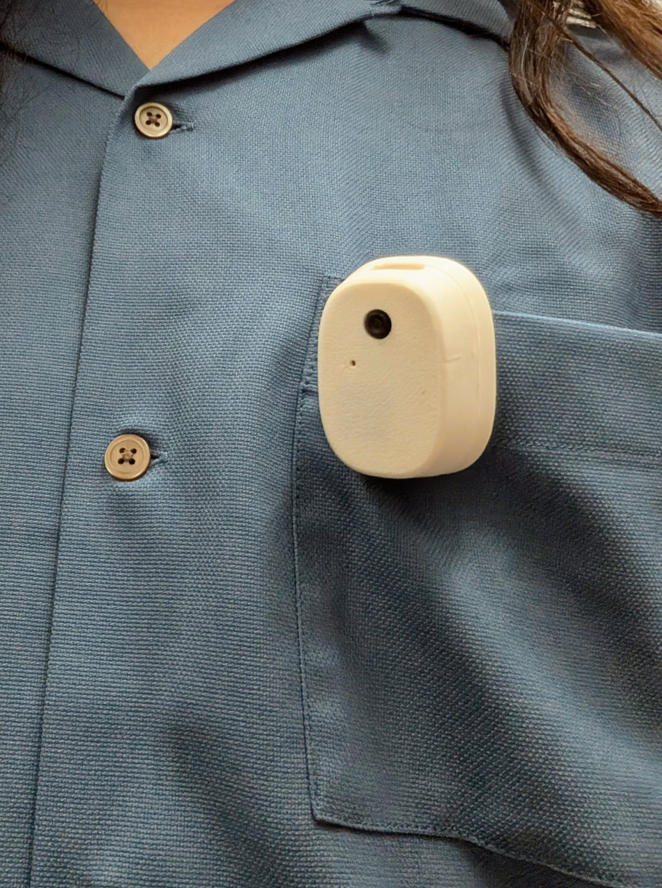

# envsens



写真と音声をキャプチャするウェアラブルデバイスと、そのコンパニオンモバイルアプリのモノレポ。
XIAO ESP32S3 Sense をベースに、自分で組み立てて使えるオープンソースのソフトウェア、ハードウェアのライフログデバイスを目指す。

## なぜつくるのか

envsens が実現したいのは、自分のライフデータの使い方を自分で決められること（自己主権）と、そのうえで AI に自分のコンテキストを渡せることの両立。

多くのライフログデバイスは、収集したデータを無条件にプラットフォーマーへ預ける構造になっている。
envsens はそれへのカウンターとして、データの所在とフローをユーザーの手元に置くことを起点に設計している。

- **ローカルファースト** — 写真・音声・文字起こし・日次要約は端末／自分のアプリ内に保持する。
- **送信先は自分で決める** — クラウド推論（文字起こし／要約／画像認識）は使うかどうかを選択でき、
  `cloudFallback: false` を選べば該当データは一切端末外へ出さない。オンデバイス推論（LiteRT / Gemma）も用意。
- **自分のコンテキストを AI へ** — 蓄積したデータを、自分の選んだモデル・経路で AI に渡せる。

## できること

- 装着して写真と音声を継続キャプチャ
- BLE でモバイルアプリへ同期（microSD があれば端末側に録り溜めて増分同期、無ければライブ転送）
- 音声の文字起こし（オンデバイス or クラウド）と、1日分の AI 要約（日記）生成

## プロジェクト構成

| ディレクトリ | 内容 | ツールチェーン |
| --- | --- | --- |
| `apps/mobile/` | Expo SDK 55 のモバイルアプリ（iOS / Android / web） | pnpm / Expo |
| `firmware/` | XIAO ESP32S3 Sense 向けファームウェア | arduino-cli（主）/ PlatformIO（代替） |
| `hardware/` | クリップ筐体（OpenSCAD パラメトリック設計。box / pebble の2バリアント） | OpenSCAD |
| `docs/` | 設計・組み立てドキュメント | — |

pnpm workspace の対象は `apps/*` のみ。`firmware` と `hardware` は Node ワークスペース外で、それぞれ独自のツールチェーン（arduino-cli / OpenSCAD）を使う。

## 作って使うまで

フォークして、部品を買い、組み立てて、使い始めるまでの導線。

| ステップ | 内容 | ドキュメント |
| --- | --- | --- |
| 1. 部品を買う | 必要な部品の型番・入手先・概算価格 | [`docs/bom.md`](./docs/bom.md) 〈準備中〉 |
| 2. 筐体を3Dプリント | STL の書き出しとプリント設定（PETG 推奨） | [`hardware/README.md`](./hardware/README.md) 〈準備中〉 |
| 3. 組み立てる | バッテリー配線・アンテナ・筐体への収納 | [`docs/assembly.md`](./docs/assembly.md) 〈準備中〉 |
| 4. ファームを書き込む | UF2 ドラッグ&ドロップ or arduino-cli | [`firmware/README.md`](./firmware/README.md) |
| 5. アプリを使う | ビルド・ペアリング・初期設定・使い方 | [`apps/mobile/README.md`](./apps/mobile/README.md) 〈準備中〉 |

> 〈準備中〉のドキュメントはこれから順次整備していく。

## 開発者向け

### 必要環境

- Node.js >= 20
- pnpm 10（`corepack enable` 推奨）
- iOS / Android 実機、または各シミュレータ・Expo Go アプリ
- ファーム開発には arduino-cli、筐体には OpenSCAD（各ディレクトリの README 参照）

### セットアップ

```bash
pnpm install
```

`pnpm install` 完了時に lefthook の pre-commit フックも自動でセットアップされる。

### モバイルアプリの起動

```bash
pnpm start            # = expo start（apps/mobile）
pnpm ios              # iOS シミュレータ
pnpm android          # Android エミュレータ
pnpm web              # web
```

`pnpm mobile <script>` で `apps/mobile` の任意のスクリプトを実行できる。
ネイティブ依存（BLE / オンデバイス推論など）を含むため、実機では `expo prebuild` + EAS dev build が必要。
詳細は [`apps/mobile/CLAUDE.md`](./apps/mobile/CLAUDE.md) を参照。

### コード品質

| コマンド | 内容 |
| --- | --- |
| `pnpm check` | Biome による lint + format（自動修正） |
| `pnpm lint` | Biome lint |
| `pnpm format` | Biome format |
| `pnpm typecheck` | `tsc --noEmit` |

pre-commit フック（lefthook）が、ステージされたファイルに対し Biome（lint + format）・`tsc`・
デザインシステムの色リテラルチェックを自動実行する。自動テストランナーはまだない。

## コントリビュート

Issue / PR を歓迎する。手順とコーディング規約は [`CONTRIBUTING.md`](./CONTRIBUTING.md) 〈準備中〉にまとめる予定。
コミットメッセージは Conventional Commits（本文は日本語）に従う。例: `feat(mobile): …` / `docs(firmware): …`。

## ライセンス

MIT License。一部に omiGlass（MIT）由来のコードを含む。[`LICENSE`](./LICENSE) を参照。
